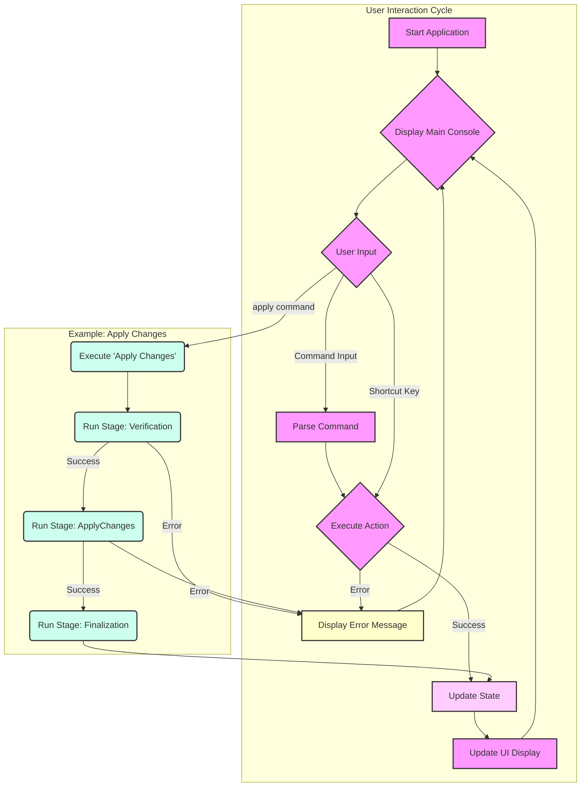

# Exliar VFIO: Command Console UI Design (Minimal Animation)

This document outlines the visual design and layout for the Exliar VFIO Terminal User Interface (TUI), focusing on a **minimal but visually pleasing aesthetic with low animation**, as requested. It draws inspiration from `docs/ui.asciidoc` for colors and symbols.

## Design Principles

1.  **Minimal & Clean:** Prioritize clarity and reduce visual clutter. Use animations sparingly and subtly.
2.  **Visually Pleasing:** Employ the defined color palette and symbols from `ui.asciidoc` for a cohesive and attractive look. Use soft borders and clear typography.
3.  **Informative:** Present essential information clearly and concisely.
4.  **Structured Layout:** Maintain a clear, logical flow with distinct sections.

## Color Palette (Reference: `docs/ui.asciidoc`)

-   **Primary Text:** White/Light Gray
-   **Borders:** Lavender (`\033[38;5;147m`) or Light Blue (`\033[38;5;159m`)
-   **Headers/Titles:** Pink (`\033[38;5;219m`) or Purple (`\033[38;5;183m`) (non-animated gradient or solid)
-   **Interactive/Highlight:** Cyan (`\033[38;5;123m`)
-   **Status:** Green (`\033[38;5;156m` - Success), Yellow (`\033[38;5;228m` - Warning), Red (`\033[38;5;210m` - Error), Blue (`\033[38;5;111m` - Info)
-   **Accent Symbols:** Pink (`♥`), Purple (`★`), Cyan (`✧`), Lavender (`•`)
-   **Background:** Dark Gray/Soft Black (`\033[48;5;236m` or similar)

## ASCII Layout Mockup (Single Console View)

```plaintext
╭───────────────────────── ✨ Exliar VFIO Console ✨ ──────────────────────────╮
│ Status: [Idle ✅]  Stage: [System Analysis]  Backup: [Enabled 💾]            │
├─•───────────────────[ System Information / Main View ]───────────────────•──┤
│                                                                              │
│  GPU 0: NVIDIA RTX 4090 [10de:2684]                                          │
│   └─ Driver: [vfio-pci]  IOMMU: [14]  Binding: [✅ Enabled]  [T]oggle [E]dit │
│                                                                              │
│  GPU 1: AMD Radeon RX 7900XTX [1002:744c]                                    │
│   └─ Driver: [amdgpu]    IOMMU: [22]  Binding: [❌ Disabled] [T]oggle [E]dit │
│                                                                              │
│  IOMMU Groups: (Showing groups with GPUs)                                    │
│   └─ Group 14: 0e:00.0 VGA, 0e:00.1 Audio [Bound: vfio-pci]                  │
│   └─ Group 22: 09:00.0 VGA, 09:00.1 Audio [Bound: amdgpu]                     │
│                                                                              │
│  Kernel Params: (Relevant VFIO params)                                       │
│   └─ intel_iommu=on [✅ Set]                                                  │
│   └─ iommu=pt [✅ Set]                                                        │
│   └─ vfio-pci.ids=10de:2684,10de:22ba [✅ Set]                                │
│                                                                              │
├─•──────────────────────────[ Action Log ]───────────────────────────────•──┤
│ [12:20:15 INFO] System analysis complete. Found 2 GPUs.                      │
│ [12:21:05 ACTION] User toggled VFIO binding for GPU 0.                       │
│ [12:21:30 INFO] Generated kernel parameters: vfio-pci.ids=10de:2684,10de:22ba │
│ [12:22:01 WARN] Bootloader configuration requires update.                     │
│                                                                              │
├─•────────────────────────[ Available Actions ]───────────────────────────•──┤
│ [D]etect System [C]onfigure Bindings [P]review Changes [A]pply Changes       │
│ [B]ackup/Restore [S]ettings [H]elp [Q]uit                                    │
├─•───────────────────────────[ Input ]───────────────────────────────────•──┤
│ > _                                                                          │
╰──────────────────────────────────────────────────────────────────────────────╯
```

## Layout Sections Explained

1.  **Header Bar (Top):**
    *   **Content:** Application Title (`✨ Exliar VFIO Console ✨`).
    *   **Aesthetic:** Solid Pink or Purple text. Minimal sparkle (`✨`). Border uses single line (`╭╮─`).
2.  **Status Bar (Under Header):**
    *   **Content:** Key status indicators (Overall Status, Current Stage, Backup Status). Uses simple status symbols (`✅`, `💾`).
    *   **Aesthetic:** Light Blue or Lavender text. Separated by `│`. No heavy animation.
3.  **Main View Area:**
    *   **Content:** Dynamically displays primary information like detected hardware (GPUs, IOMMU groups), relevant kernel parameters, or configuration options. Focuses on concise presentation.
    *   **Aesthetic:** Uses indentation (`└─`) for hierarchy. Status indicators (`[✅ Set]`, `[❌ Disabled]`) use Green/Red. Interactive elements like `[T]oggle` use Cyan. No sub-boxes unless necessary for clarity. Minimal symbols (`✧` removed).
4.  **Action Log:**
    *   **Content:** Displays a chronological log of significant actions and system events. Uses color-coded log levels (INFO=Blue, WARN=Yellow, ERROR=Red, ACTION=Purple). Timestamps included.
    *   **Aesthetic:** Simple list format. No heavy framing.
5.  **Available Actions Bar:**
    *   **Content:** Lists currently available high-level actions with keyboard shortcuts highlighted (`[D]etect`).
    *   **Aesthetic:** Single line, Cyan text for shortcuts.
6.  **Input Bar (Bottom):**
    *   **Content:** User input prompt (`>`).
    *   **Aesthetic:** Simple prompt. Blinking cursor (`_`) is the primary animation. Border uses single line (`╰╯─`).

## Minimal Animation & Effects

-   **Cursor:** Standard blinking cursor in the input field.
-   **Progress Indication:** Instead of animated bars, use simple text updates in the status bar or action log (e.g., "Applying changes... Step 2/5"). A simple spinner (`⠋⠙⠹⠸⠼⠴⠦⠧⠇⠏` or `-\|/`) can be used next to the status text during operations.
-   **Status Changes:** Update text and symbols directly (e.g., `[Idle ✅]` changes to `[Running 🔄]`). No pulsing or sparkles.
-   **Highlights:** Use background color changes (e.g., Cyan background) for selected items in lists instead of heavy animations.

## User Action Flow (Mermaid Diagram)



This revised design focuses on clarity and a clean aesthetic, using color and symbols effectively while minimizing distracting animations, aligning with the `ui.asciidoc` reference and the request for low animation.