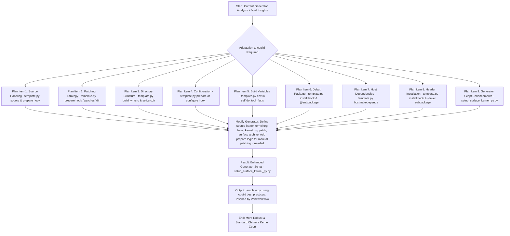

# Plan: Enhancing Chimera Cport Generator for `linux-surface`

**Objective:** Modify the existing Chimera cport generator script (`chimera/py/setup_surface_kernel_py.py`) to produce a `template.py` for `linux-surface` that incorporates robust packaging strategies inspired by the Void Linux `linux-surface` package, adapted for the Chimera Linux `cbuild` system.

**Context:** This plan builds upon an analysis of the Void Linux `linux-surface` xbps-src template (PR #32823) and the Chimera Linux cports packaging documentation. The core idea is to translate successful concepts from Void/xbps-src into idiomatic `cbuild` practices.

## Mermaid Diagram of the Plan

## Detailed Plan Items (Modifications to `setup_surface_kernel_py.py` and its generated `template.py` output):

1.  **Source Handling (Generator -> `template.py` `source` variable & `prepare()` hook):**
    *   **Generator Action:** Modify `generate_template_py_content` in `setup_surface_kernel_py.py`.
    *   **Generated `template.py`:**
        *   The `source` list variable will include URLs for:
            1.  Base kernel tarball from `kernel.org` (e.g., `https://cdn.kernel.org/pub/linux/kernel/vX.x/linux-{{versions.major_minor}}.tar.xz`).
            2.  Incremental kernel patch from `kernel.org` (e.g., `patch-{{pkgver}}.xz`).
            3.  `linux-surface` specific patches/configs archive from GitHub releases (e.g., `https://github.com/linux-surface/linux-surface/archive/refs/tags/{{surface_archive_tag}}.tar.gz>surface-patches-{{pkgver}}.tar.gz`).
        *   The `prepare()` method in the generated `template.py` will:
            *   Manually apply the `kernel.org` incremental patch if it's not placed in `patches/` for automatic application. Example: `self.do("xzcat", self.sources_path / "patch-X.Y.Z.xz", "|", "patch", "-Np1", wrksrc=self.build_wrksrc)`.
            *   Ensure the `linux-surface` archive is extracted. `cbuild` typically handles extraction of sources listed in the `source` variable. The path to this extracted archive will be needed.
            *   Apply Surface patches (see Item 2).

2.  **Patching Strategy (Generator -> `template.py` `prepare()` hook / `patches/` dir):**
    *   **Generator Action:**
        *   The generator will place critical, standalone patches (e.g., `fix-musl-objtool.patch` identified from Void analysis) into the cport's `patches/` directory. These will be applied automatically by `cbuild` before the `prepare()` hook.
    *   **Generated `template.py` (`prepare()` method):**
        *   After the `kernel.org` incremental patch (if manually applied), the Surface patches will be applied. These will be sourced from the extracted `linux-surface` archive.
        *   Logic: Iterate through patch files found within the extracted Surface archive (e.g., in a `patches/X.Y/` subdirectory of the archive) and apply them using `self.do("patch", "-Np1", "-i", chroot_path_to_surface_patch, wrksrc=self.build_wrksrc)`.

3.  **Directory Structure (Generator -> `template.py` `build_wrksrc` & hook usage):**
    *   **Generator Action:**
        *   The generator will set `build_wrksrc = "linux-X.Y"` (where X.Y is the major.minor version from kernel.org, e.g., `linux-6.8`) in the generated `template.py`'s metadata if the main kernel tarball extracts to such a directory.
    *   **Generated `template.py`:**
        *   All build operations (`configure`, `build`, `install` phases) will implicitly operate within `self.build_wrksrc` if set, or `self.srcdir` otherwise, as `cbuild` manages the current working directory for these standard hooks.

4.  **Configuration (Generator -> `template.py` `prepare()` or `configure()` hook):**
    *   **Generator Action:** Modify `generate_template_py_content` to include these steps in the generated `template.py`'s `prepare()` or `configure()` method.
    *   **Generated `template.py`:**
        *   Copy base config: `self.cp(self.files_path / "config.x86_64", self.chroot_build_wrksrc / ".config_base")`. (The generator will place the appropriate base config into `files/`).
        *   Copy Surface-specific config: This will be copied from the extracted `linux-surface` archive into `self.chroot_build_wrksrc / ".config_surface_fragment"`.
        *   Merge configs: `self.do("./scripts/kconfig/merge_config.sh", "-m", ".config_base", ".config_surface_fragment", out_file=".config", wrksrc=self.build_wrksrc)`.
        *   Finalize configuration: `self.do("make", *self.make_flags, f"KCONFIG_CONFIG={self.chroot_build_wrksrc / '.config'}", "olddefconfig", wrksrc=self.build_wrksrc)`.
        *   Set local version: `self.do("sed", "-i", f"s|^CONFIG_LOCALVERSION=.*|CONFIG_LOCALVERSION=\\\"-{self.pkgrel}-surface\\\"|", ".config", wrksrc=self.build_wrksrc)`.

5.  **Build Variables & Environment (Generator -> `template.py` `tool_flags`, `env` in `self.do()`):**
    *   **Generator Action:**
    *   **Generated `template.py`:**
        *   Reproducibility variables like `KBUILD_BUILD_TIMESTAMP=self.source_date_epoch_bsd`, `KBUILD_BUILD_USER="chimera"`, `KBUILD_BUILD_HOST="chimera"` will be passed via the `env={...}` argument to `self.do("make", ...)` calls.
        *   `LDFLAGS` can be cleared or managed via `tool_flags = {"LDFLAGS": []}` at the template level or passed as `env={"LDFLAGS": ""}` in `make` calls if specific clearing is needed for kernel builds.

6.  **Debug Symbol Package (Generator -> `template.py` `install()` hook & `@subpackage`):**
    *   **Generator Action:**
        *   The generator will create a `mv-debug.sh` script (adapted from Void's, using `llvm-objcopy`, `llvm-strip` if appropriate for Chimera, and correcting the `gzip` line for `.ko` files) and place it in the cport's `files/` directory.
    *   **Generated `template.py`:**
        *   The `install()` method will:
            *   Iterate over `*.ko` files in `self.destdir` and call the `mv-debug.sh` script: `self.do(self.chroot_files_path / "mv-debug.sh", chroot_path_to_ko_file_in_destdir)`.
            *   Handle `vmlinux`: Copy `vmlinux` from `self.chroot_build_wrksrc` to `self.destdir / "usr/lib/debug/boot/vmlinux-{kernelrelease}"` and then call `mv-debug.sh` on the original `vmlinux` if it's also installed to `/boot` (or handle stripping appropriately).
            *   Ensure debug symbols are placed in `self.destdir / "usr/lib/debug"`.
        *   A subpackage `@subpackage(f"{self.pkgname}-dbg")` will be defined to `self.take()` files from `usr/lib/debug` and potentially `/boot/System.map-{kernelrelease}`.
        *   The main package might use `options = ["!strip"]` if `mv-debug.sh` handles all stripping, or rely on `cbuild`'s default stripping and have `mv-debug.sh` only separate already stripped symbols.

7.  **Host Dependencies (Generator -> `template.py` `hostmakedepends`):**
    *   **Generator Action:**
    *   **Generated `template.py`:**
        *   The `hostmakedepends` list will be populated with appropriate Chimera packages: `base-kernel-devel` (provides many tools like `kmod`, `perl`, `bc`), `elfutils-devel` (for `pahole` and potentially `objcopy`/`strip` if not using LLVM's), `llvm` (for `llvm-objcopy`, `llvm-strip` if preferred), `openssl-devel`, `flex`, `bison`, `python`.

8.  **Header Installation (Generator -> `template.py` `install()` hook & `-devel` subpackage):**
    *   **Generator Action:**
    *   **Generated `template.py`:**
        *   The `install()` method will include logic adapted from the Void template to copy kernel headers, Makefiles, and other necessary files from `self.chroot_build_wrksrc` to a versioned directory within `self.destdir / "usr/src/"` (e.g., `self.destdir / f"usr/src/{self.pkgname}-{self.pkgver}-{self.pkgrel}-headers"`). This will use `self.install_file()`, `self.cp()`, and `self.install_dir()`.
        *   A subpackage `@subpackage(f"{self.pkgname}-devel")` will be defined to `self.take()` these installed headers.

9.  **Generator Script Enhancements (`setup_surface_kernel_py.py`):**
    *   Add new command-line arguments to `setup_surface_kernel_py.py` for:
        *   Kernel.org base version (e.g., `6.8`).
        *   Kernel.org specific patch version (e.g., `6.8.1`).
        *   The tag or specific URL for the `linux-surface` project's patch/config archive.
    *   Update checksum generation/placeholder logic in the generator to account for these three distinct sources.
    *   Modify how the generator sources Surface patches and configs. Instead of relying on `args.linux_surface_repo_base_path` (a local git clone), it will now expect these to be part of the fetched `linux-surface` archive. The generated `template.py` will contain logic to extract/find these files within that archive.

This revised plan should provide a clear path to enhancing the generator script, ensuring the produced `template.py` files are robust, maintainable, and well-integrated with the Chimera Linux `cbuild` system.